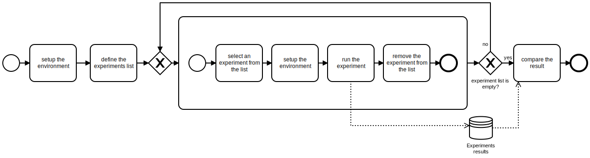

# Introduction
This folder contains instructions for repeating the evaluation section, which is used in the "Graph-based process mining" paper.
The paper is accepted in the 5th International Workshop on Process Querying, Manipulation, and Intelligence ([PQMI 2020](http://processquerying.com/pqmi2020/)), which is co-located with the 2nd International Conference in Process Mining ([ICPM 2020](https://icpmconference.org/2020/)). 

The link for the author-copy and published version will be available soon.

You can cite this paper by:
```
coming soon
```

# Evaluation Process
The evaluation process in this paper is shown in figure below.



This process shall be followed through these steps:
  1. The process starts by "setup the environment", where you need to have installed the docker in your computer. 
  2.  The "define the experiments list" shall be done to define the number of experiments and their parameters as a list.
  3.  The "select an experiment from the list" shall be performed to select an experiments and its parameters.
  4. The "setup the environment" shall be performed to set the analysis environment for the selected experiemnt.
  5. The "run the experiment" shall be performed to measure the performance.
  6. The "remove the experiment from the list" shall be performed to remove the experiement from the list.
  7. If the experiment list is empty, the process shall be repeated from step 3.
  8. All results shall be compared by performing the "compare the result" task.

These steps are explained below.

## setup the environment
Your docker needs to have access to your hard drive for mounting the volumes that store data for event repository. Note that you also need to assign enough CPUs and memory to your docker to be assigned for conatiners in the evaluation later.

## define the experiments list

## select an experiment from the list

## setup the environment

## run the experiment

## remove the experiment from the list

## compare the result

